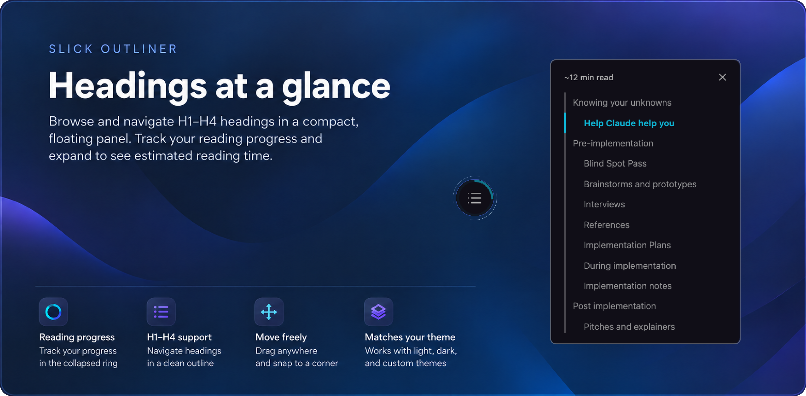
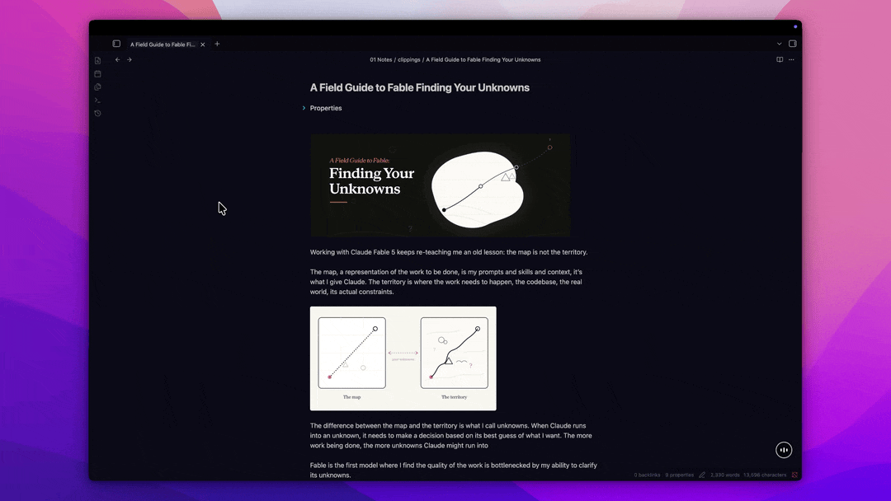

# SlickOutline

**A compact, floating outline that keeps long Obsidian notes easy to navigate.**

SlickOutline gives each note pane its own lightweight document outline. Open it
when you need to jump between headings, collapse it when you want a clear
workspace, and follow your reading progress without giving up space to a
permanent sidebar.



## Features

- Browse and navigate H1-H4 headings in a compact, floating panel.
- Track reading progress in the collapsed ring and see estimated reading time
  when the outline is open.
- Drag the control anywhere, snap it to a corner, and use it independently in multiple panes and pop-out windows.
- Match light, dark, and custom themes.

## Demo



## Getting started

1. Enable **SlickOutline** in Obsidian's Community plugins settings.
2. Open a Markdown note in Live Preview or Reading View.
3. Run **SlickOutline: Show outline** from the command palette.
4. Select the circular control to open the outline, then select a heading to
   navigate to it.

Run the command again to remove SlickOutline from the current pane. You can
also assign the command a hotkey in Obsidian's settings.

SlickOutline is pane-local: enabling, expanding, and navigating the outline
affects only the pane you are working in. Switching notes keeps the outline
enabled but collapses it.

## Customize the outline

### Placement

Choose **Top left**, **Top right**, **Bottom left**, or **Bottom right** under
**Settings -> SlickOutline -> Placement**.

You can also drag the collapsed control to create a custom position. A snap
preview appears near pane edges, and the saved position adapts proportionally
when the window changes size. Selecting a corner in settings replaces the
custom position.

### Reading speed

Set your preferred words per minute under
**Settings -> SlickOutline -> Reading speed**. SlickOutline uses it to estimate
the reading time for the current note while excluding frontmatter and code
blocks.

Use **Reset to defaults** to restore the top-left placement and a reading speed
of 200 words per minute.

## Compatibility and behavior

- SlickOutline is desktop-only.
- Live Preview and Reading View are supported.
- Source Mode is not supported; the control hides until you return to a
  supported view.
- Heading labels and reading time refresh when the panel reopens rather than
  after every edit.
- The outline remains open while scrolling or navigating between headings.
- Placement and reading speed are shared settings, while outline visibility is
  managed independently for each pane.

## Installation

### Community plugins

Once SlickOutline is available in the Obsidian Community Plugins directory:

1. Open **Settings -> Community plugins**.
2. Select **Browse** and search for **SlickOutline**.
3. Install and enable the plugin.

### Manual installation

Download `main.js`, `manifest.json`, and `styles.css` from the latest GitHub
release. Place them in:

```text
<your-vault>/.obsidian/plugins/slick-outline/
```

Reload Obsidian, then enable **SlickOutline** under **Community plugins**.

## Development

From the plugin directory:

```sh
npm install
npm run build
```

`npm run build` runs the strict TypeScript check and creates the production
`main.js` bundle. Use `npm run dev` to rebuild continuously during local
development.

The source is organized into pane lifecycle and DOM integration under
`src/views/`, React presentation under `src/components/`, and navigation,
geometry, progress, and editor adapters under `src/slick-outline/`.

## Feedback

Report bugs or suggest improvements through
[GitHub Issues](https://github.com/shettypuneeth/slick-outline-obsidian/issues).
